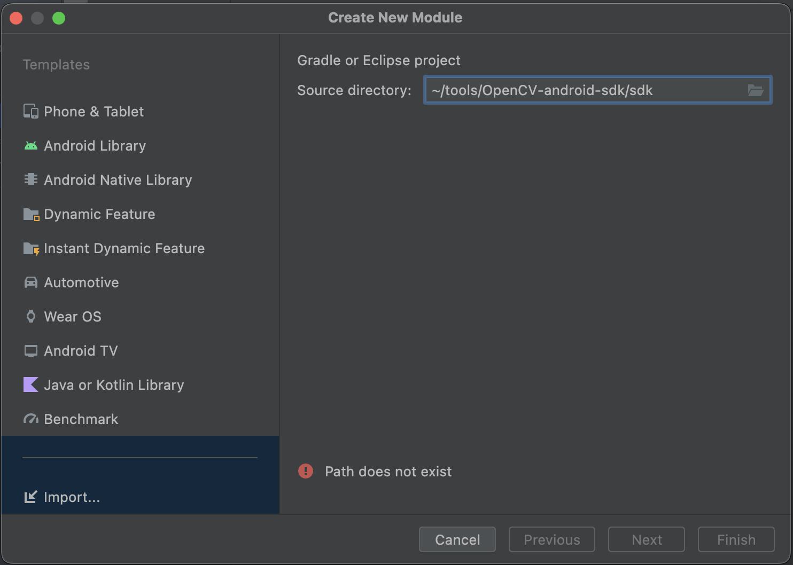

# (AR)droid
This project showcases Augmented Reality (AR) on Android by projecting a cube onto a reference object. 
It uses the OpenCV 4.8.0 SDK for Android and Kotlin. 

The Computer Vision algorithms have been taken from [https://github.com/Wissiak/augmented-reality-on-webcam](Augmented Reality on Webcam).
The mobile version has been rewritten to Kotlin and has been enhanced with some mobile functionalities. 
The goal of this project was not to improve performance but rather to show the feasibility of a simple AR project on mobile devices.

## Showcase

## Project Setup
1. Download the OpenCV 4.8.0 Android SDK from [https://opencv.org/releases/](OpenCV Releases)
2. Unpack the downloaded folder to a folder of your choice (e.g. ~/tools/OpenCV-android-sdk)
3. Clone this repository
4. Open this repository in Android Studio
5. Open "Project Structure... > Modules" and click on "New Module"
6. Click on "Import Module" and specify the unpacked folder with "/sdk" appended (e.g. ~/tools/OpenCV-android-sdk/sdk)

7. Wait for Gradle build to (hopefully) finish successfully
8. Start the App! :)

## Notes
The feature detection and feature matching are not running very fast on a mobile device. 
If you want a smoother video, the emulator can be used.